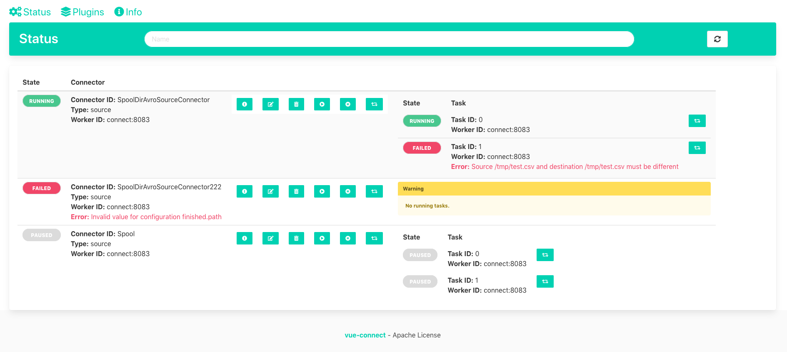

# vue-connect

**vue-connect** is a simple and open source Kafka Connect UI for setting up and managing connectors. 

> **Note**: This project is under development and fare away from production ready.

## Features
- Connector status overview
- Delete, pause and resume connectors
- Restart tasks and connectors
- Install new connectors
- Update connector configuration



## Components
vue-connect is build with [Vue.js](https://vuejs.org/) and [Python](https://www.python.org/).

- [vue-connect-api](vue-connect-api) - the backend service project. 
- [vue-connect-ui](vue-connect-ui) - the ui project. 
- The UI and API are bundled together in a [Docker](Dockerfile) image. 

## Run vue-connect

`CONNECT_URL` is the Kafka Connect Rest Endpoint URL which you want to access
with vue-connect.

```
docker run --rm -it -p 8080:8080 \
           -e "CONNECT_URL=http://CONNECT_REST_ENDPOINT:PORT" \
           rueedlinger/vue-connect:v0.1.0
```

> The *vue-connect* Web UI will be available at http://localhost:8080
 
You can modify the Compose file [docker-compose.yml](docker-compose.yml) and use a prebuilt vue-connect image from Docker Hub.
```
vue-connect:
  image: rueedlinger/vue-connect:v0.1.0
  hostname: vue-connect
    
  depends_on:
    - connect
  
  ports:
    - "8080:8080"
  
  environment:
    CONNECT_URL: "http://connect:8083"
```


## Build from Source
- See [vue-connect-ui](vue-connect-ui/README.md) how you can build the *Vue.js* frontend.
- See [vue-connect-api](vue-connect-api/README.md) how you can build the *Python* backend.


### Docker Image

To run the vue-connect locally you use the Docker image. This image will
bundle the frontend and backend together in one image.

```
docker build . -t vue-connect
```

Next we can start the Docker image. With `CONNECT_URL`you can set the Rest Endpoint which should be used by vue-connect.
```
docker run --rm -it -p 8080:8080 -e "CONNECT_URL=http://localhost:8083" vue-connect 
```

### Docker Compose 
Or you can use the Docker Compose file [docker-compose.yml](docker-compose.yml) which starts a Kafka Connect cluster with the latest vue-connect version from this branch.

```
docker-compose up --build
```

## License
The project is licensed under the [Apache](LICENSE) license.
