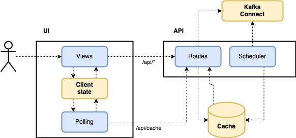

# Architecture

## Components

vue-connect is build with [Vue.js](https://vuejs.org/) and [Python](https://www.python.org/).

- [vue-connect-api](vue-connect-api) - the backend service project. 
- [vue-connect-ui](vue-connect-ui) - the ui project. 
- The UI and API are bundled together in a [Docker](Dockerfile) image with the nginx web server. 

## Syncing Cluster State and UI State

- The _API scheduler_ is constantly syncing with the cluster state when the Connect API is available. By default every minute the cache is synced with the cluster state.
- The _UI scheduler_ is responsible to keep the client state in sync with the cached cluster state from the backend service (API).
- Frontend operations communicate through the backend service directly with Connect API. The cache is only used when Connect API is down.

