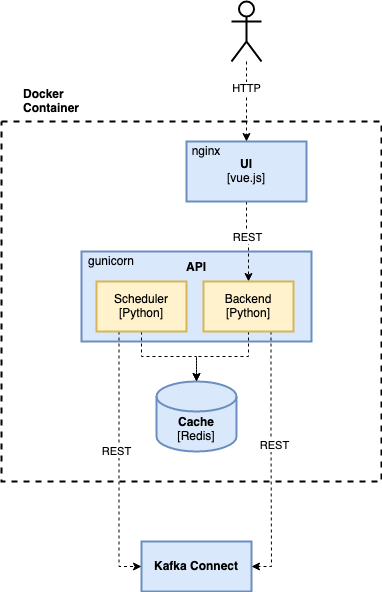

# Architecture

## Components

vue-connect is build with [Vue.js](https://vuejs.org/) and [Python](https://www.python.org/).

- [vue-connect-api](vue-connect-api) - the backend service project (API). 
- [vue-connect-ui](vue-connect-ui) - the UI project. 
- The UI and API are bundled together in a [Docker](Dockerfile) image with the _nginx_ web server and _gunicorn_. 

## Syncing Cluster State and UI State

- The _scheduler_ is polling the Kafka Connect cluster and stores the result in the cache (SQLite DB).
- The _UI_ is continuously polling the cache and updating the view. The main operation by the user are not cached and redirect to the Kafka Connect cluster. If the cluster is not available the last sate from the cache is returned with an error message.

